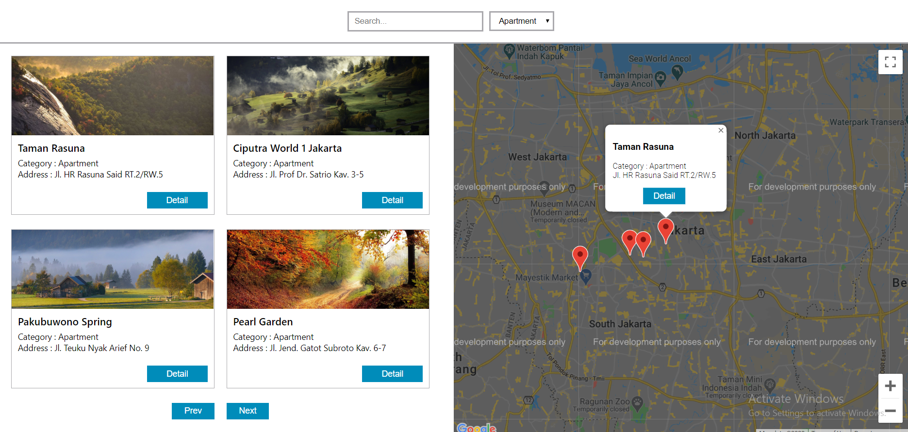
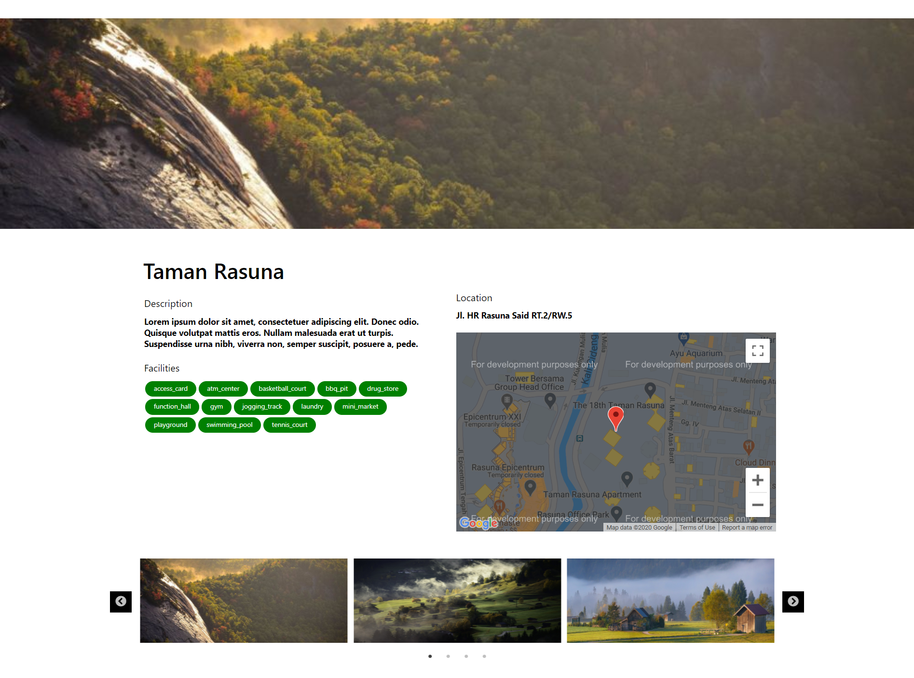

# Google Maps with MERN Stack

MongoDB, Express js, React js, Node js


## Backend Node

```bash
create mongo database with name "gmapCrud"
restore dump file with command "mongorestore --gzip --archive=/path/to/gmapCrud.archive"

npm install
npm start

backend will run on port 3001

```


## Frontend React

```bash
cp .env.example .env, 
update google maps api key on .env file

npm install
npm start

Open Browser with Url: http://localhost:3000/

```

## REST API DESIGN

Rest api design

```
  get    /places?page=1&name=park&category=apartment     get map list with filtering and pagination
  get    /places/5                 get a map
  post   /places/              	   create a map
  put    /places/5         	       update a map
  delete /places/5                 delete a map
    
  DB Structure
  {
     "name": "name",
     "category": "apartment",
     "description": "desc",
     "address": "address",
     "city": "city1",
     "coordinate": {
         "lat": 23,
         "lng": 22
     },
     "facilities": ["fas1", "fas2", "fas3", "fas4"],
     "images" : ["img1","img2","img3","img4"]
  }
```

Main Page




Detail Page




Todo : 
- Responsive Layout
- Implement CRUD on frontend
